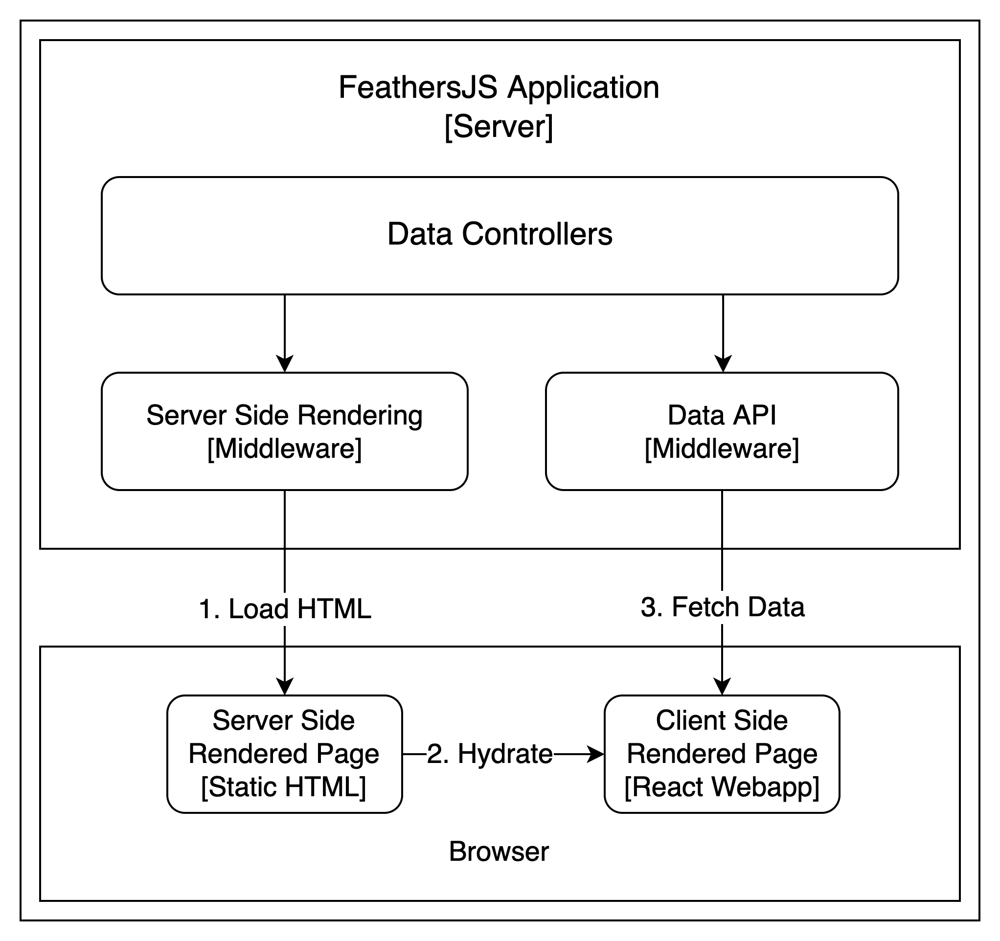

# Full Stack TypeScript Server Side Rendering with Umijs and FeathersJS

> This is a full stack TypeScript Server-Side-Rendering scaffolding with React/UmiJS and FeathersJS.

## Quick Start

```bash
# Install dependencies and compile web frontend project.
./build.sh # or bash build.sh
# Start web server.
cd server && npm start
```

Open <a href='http://localhost:3030' target='_blank'>http://localhost:3030</a> in browser.

## How Does It Work?



1. Server Side Rendering middleware renders `static html page` with `data controllers`.
2. Browser loads the `static html page`, and run [hydration script](https://reactjs.org/docs/react-dom.html#hydrate) to
   swap the `root div` with a React web application after the `static page` is loaded.
3. React web application `navigates` and `renders` pages from client side, and fetches data from API that shares the
   same `data controller` with `server side rendering middleware`.

## Frontend Development Guide

### Enable SSR in UmiJS

The frontend project is located in `web` folder. It is an [UmiJS 3](https://v3.umijs.org/) project which provides out of
box SSR solution. All you need to do to enable SSR in an UmiJS project is to add `ssr: {}` in config file.

```typescript
export default defineConfig({
    // ...
    ssr: {},
});
```

### Write A Page Component That Supports SSR

To enable SSR for a React component, you need to add a `getInitialProps` function to your component. This function will
be called by the SSR middleware while rendering the static html page.

Please see comments in [web/src/pages/posts.tsx](web/src/pages/posts.tsx) for more details.

## Server

### Enable Allow JavaScript

Since Umijs' Server Side Render is exported as a JavaScript module, you need to `allowJs` in `tsconfig.json`, so that
the JavaScript module will be copied to `lib` directory in `production` mode.

While `allowJs` is set to true, you'll also need to exclude `public` directory in `tsconfig.json` to avoid
compiling `public` directory.

```json
{
  "compilerOptions": {
    "allowJs": true
  },
  "exclude": [
    "public"
  ]
}
```
